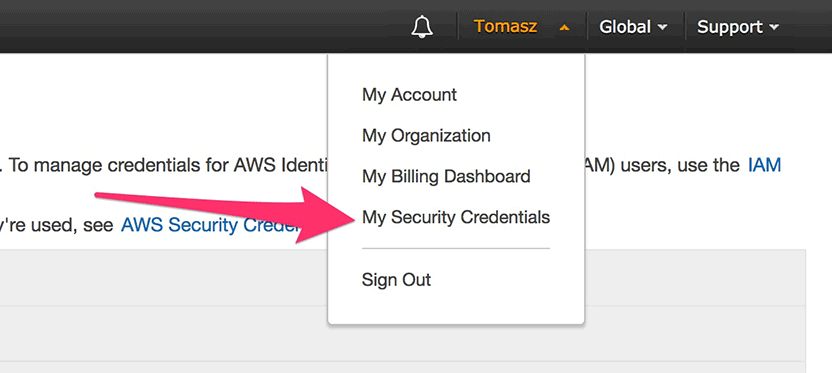
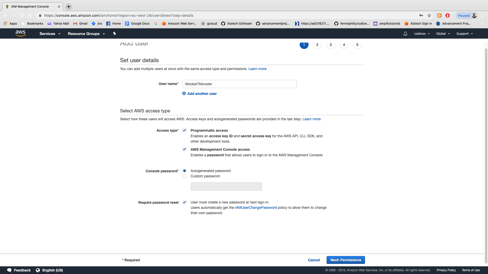
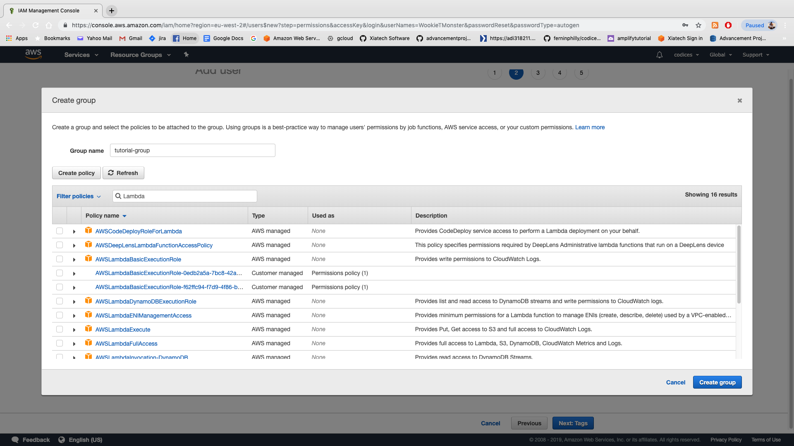
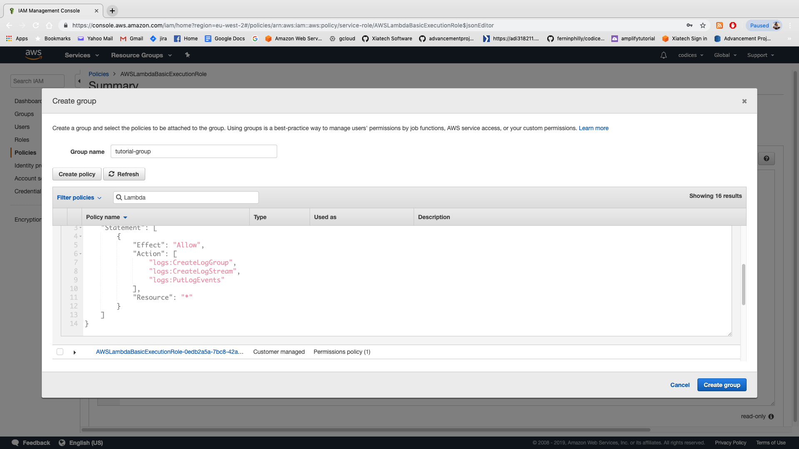
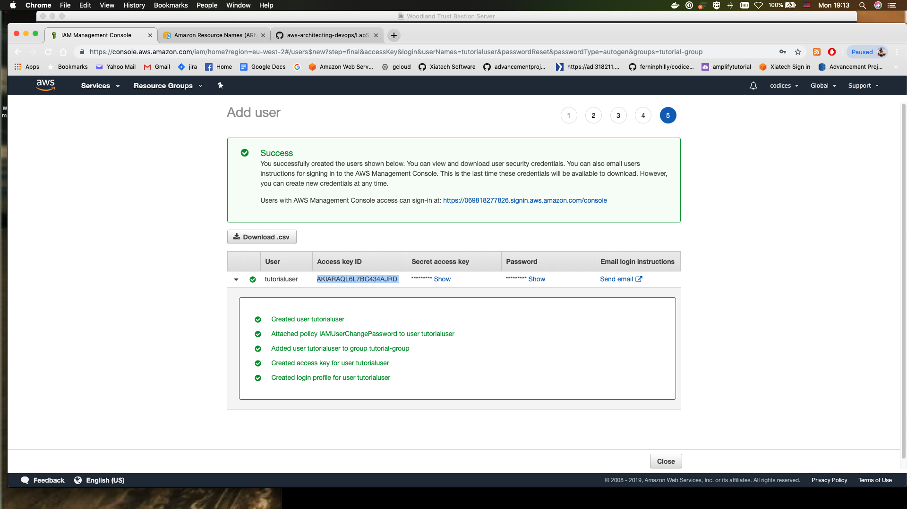

# INTRO- setting up your Environment

## Setting up your AWS environment

### Prerequisites

For this class you will need to have an AWS account set up. Please note that although AWS **does** ask for credit card details there is __nothing__ in this class that will cost you any actual money. The purpose of this class is to get everyone familiar with terraform- which is a key tool in the **Infrastructure-As-Code** philosophy. A big part of the IAC philosophy is that any infrastructure that you run is intended to be __ephemeral__- i.e: it is not intended to last and you need to be able to build it/take it down at a moment's notice. In that tradition- any infrastructure that we put up in this class WILL be torn down using the same methodology.
So to summarize: YES- you will need an AWS account but NOTHING we do in this class will cost you any money on that AWS account.

#### Now let's get set up on the AWS free tier

1. For the next step we're going to set up our AWS accounts. This should be pretty straightforward and I'm not going to cover everything here...suffice to say please make sure that you have an aws [account](https://portal.aws.amazon.com/billing/signup#/start)

2. Head to your [aws-management-console](https://console.aws.amazon.com). This is an excellent list of all of the available services. What we need at the moment is our aws_secret_keys and aws_access_keys from the services list here. Fortunately (as of March of this year) AWS has created a single location to find these items: in the top right hand corner of your screen under your username:


3. NOW- as part of this lab we are going to use a best practice for aws managers and, instead of utilizing the **root user** we're going to take this opportunity to create a separate user for the class. This is excellent practice for when you are creating access for individual users in your organization. 

4. **IF** you want to use the root user to access and create everything for this class (seriously though...don't...it's terrible practice) you can skip ahead. 
But again...seriously: don't do that. Create a user...OTHERWISE managing the root user comes with all of the issues you'd expect (managing permissions, removing/deleting or adding permissions, etc)

5. So let's create a user in the IAM management console. In the **services** search bar at the top of your console page type in **IAM**. That should take you to your IAM console screen:


6. Now we want to create a user. This is actually a pretty easy thing to do- click on the **users** link and click on **add user**

7. Set up your user details as you'd like (make the user name your pet's name or something) and click on **both** Programmatic access and AWS Management Console access. Feel free to leave console password and require password resource checked off (this is what you will probably be doing when you create accounts for your devs).


8. Go to ADD USER TO GROUP. Here is where we would create a group for our users if we had a group we wanted to add them to (so, for instance, like "Accounting" or "Junior Devs" or something). Click on "Create Group" and you'll see a list of **policies**.

9. These are pre-built policies that AWS has been kind enough to create for us. In the Group Name bar type `terraform-tutorial-group`.

10. IN the search bar next to **Filter policies** do a search for **Lambda** functions. You should see something like this:


11. Click on the **AWSLambdaBasicExecutionRole** and you can see there the basic JSON structure around how policies are dictated. One thing to notice here is the **"Resource": "*"** at the bottom. If you add the **arn** of a resource (a lambda function, DynamoDB table, EC2 instance or Redshift db) to this resource section then the policy will apply __only__ to that resource (and you can have multiple resources there if you wish):


12. For now let's start by giving our user access to s3 (to start). Yes- it's possible to give **AdministratorAccess** to a user but this is not advised for anything less than your most senior developer (or someone you really, really trust). For now we're going to be adding permissions one at a time in order to get a tightly controlled user set up.

13. So let's start with just s3.... grant full access to AmazonS3FullAccess by clicking on **Amazons3FullAccess** and then clicking **create Group**

14. Click on **create Tags**. Do this if you want...it's pretty self explanatory. Next click **Next: Review** and then **Create User**

15. __Voila__: you have created your first user! Congratulations. __Do Not Click Beyond This Page Until You Have Downloaded the Secret and Access Keys In CSV format__


16. Download the csvs. **These contain your secret and access keys and need to be kept secret!**

17. So now we have our aws keys. At this point I want to show you how to set up the credentials on your host machines...which you'll want to do with your root access credentials to effectively utilize the aws cli.

#### Managing keys on your host machine

1. Our next step is to set up our keys locally so that we can use them with the AWS CLI. Fortunately the aws cli makes this extremely easy. If you have not yet installed the aws CLI on your local host machine __and only if you want to__ Click [here](https://docs.amazonaws.cn/en_us/cli/latest/userguide/install-windows.html) for windows install instructions and [here](https://docs.aws.amazon.com/cli/latest/userguide/install-macos.html) for mac instructions. 

2. There are several ways to manage our aws keys that allow us to effectively use them for the AWS command line interface. We're going to demonstrate two separate methods here:
    
    a: For managing keys on your **host** machine simply type `aws configure` into your command line. This will bring up a command line that asks for your aws access key ID. Go ahead and copy that from the .csv you downloaded and hit enter.

    b: Same thing for the Secret Access Key

    c: For default region type in `eu-west-1` (for Ireland)

    d: For default output format choose JSON

    ...and __voila__! We have a working aws configuration! To check on it:

    a: On MAC type `cat ~/.aws/credentials` and you should see something that looks like this: 
        ```
        [default]
        aws_access_key_id = 123PLEASEDoNtHACKME
        aws_secret_access_key = EKOERJKOEREROIER*#$#$@$##$
        ```
    b: On WINDOWS navigate to `C:\Users\USERNAME\.aws\credentials` and you can open the file in the text editor.

Now- much like anything else- you guys might want to, over time, add in other credentials to these basic ones. Right now these credentials are listed as `default`. Let's upgrade that by creating them as a "profile"...which is also simple: type in `aws configure --profile tutorial` and go through the process again. When you open up the credentials again you should see a new profile header: **[tutorial]** there. When we run commands from the CLI using this profile we simply need to append a `--profile tutorial` to the end.

3. The **second** method here is simply to export your AWS secret and access keys as environment variables on your host machine. While this is certainly not an __ideal__ way to manage your keys (you would need to __export__ or __set__ them as environment variables with every new session unless you manually copied them into your load scripts like **bash_profile** to have them load __every__ time...and generally you don't want to have that hassle).

4. The "Environment variable" method is ideal if you are running a lot of virtual machines on your host computer and you don't want to deal with the hassle of setting up the aws cli on all of them. The idea here is that you could just pass in the environment variables as you provision your machine- either in the **vagrant file** or **dockerFile**. 

5. Basically what happens is that any time you do an aws cli command the aws cli will look for the following environment variables:

* AWS_ACCESS_KEY_ID
* AWS_SECRET_ACCESS_KEY
* AWS_DEFAULT_REGION
* AWS_DEFAULT_OUTPUT
* AWS_CA_BUNDLE (if you have a certificate bundle you want to use for ssl)

## Installing Terraform

Now all that's left to do is install terraform.
For this class we'll be using terraform 0.12.3- which is the latest stable release (as of July 2019)

#### For MAC

1. For Mac it's pretty simple- open up your CLI and type in `brew install terraform`.

2. If you don't have [homebrew](https://brew.sh/) yet on mac you should totally install it. Like now.

3. Run the command `terraform -version` on your command line.

#### For Windows

1. Download and install [Terraform](https://www.terraform.io/downloads.html) from the main terraform site (windows 64-bit...probably)

2. Create a **terraform** folder in your C-drive (C:\terraform)

3. Copy files from the downloaded zip into the C-drive you just created

4. Open the command prompt __as an administrator__ and set the PATH to use the terraform binaries: `set PATH=%PATH%;C:\terraform`

5. Now run the command `terraform -v` on the command line and you should see version 0.12.3.
