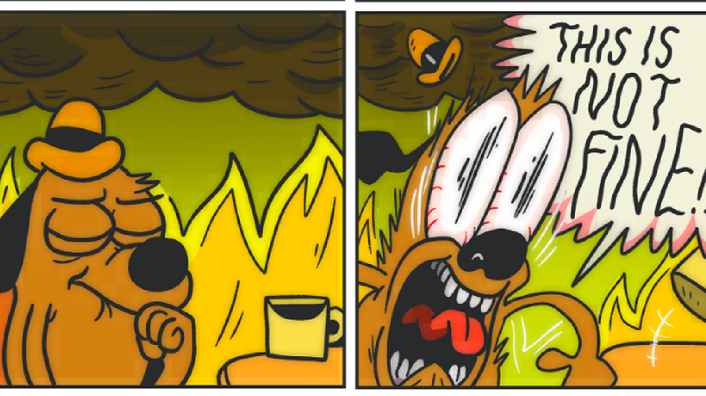
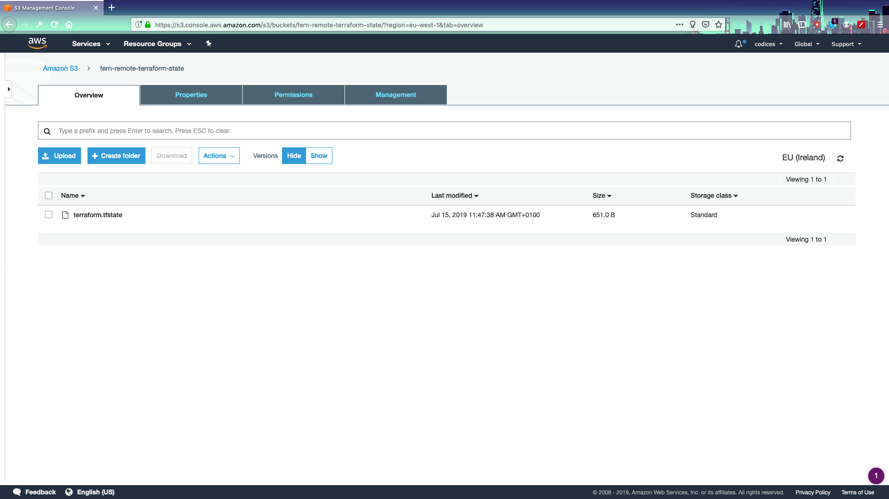

# Lab Four

## Managing your terraform infrastructure

This lab and module will focus mainly on the best ways to manage your terraform infrastructure. I want to emphasize some tips and tricks that have worked for me in the past. This lab will, out of necessity, be less "hands on" and focus more on lecture/discussion about best practices around keeping your infrastructure-as-code in general and terraform specifically.

### Backend Configuration

1. If you've been paying attention to your directories you've probably noticed that you are getting a couple of files created with `terraform init`...specifically things like `terraform.tfstate` and `terraform.tfstate.backup`. Opening these you'll see that it's a basic JSON representation of the current state of your terraform infrastructure. Here's the issue: __currently it only exists locally to your host computer__

2. So imagine, if you will, you have a terraform infrastructure that is being worked on by multiple people- each of whom is creating and destroying different resources in your AWS account all the time. You can see where this would be (could be) a serious issue... so we need to worry about how to manage it if YOUR particular terraform state is out of whack with what another member of your team's state might be.

3. To solve for this we can create a bucket that is kept remotely that keeps the current "state" of the infrastructure in it at all times! If we give everyone on our team access to said bucket then they can use it to update their __local__ terraform state to the current terraform state of the infrastructure! __and just like that we can create these terraform structures in teams__!

4. So let's do that now! We will have to do this in two steps in order for it to be effective:
    * Create an s3 Bucket in which to store our state and 
    * Set terraform to set our **tfstate** files up to said bucket.

5. So- to start out with let's create our s3 bucket. NOW- the issue here is that we can't create this s3 bucket **with** our terraform files as terraform backup locations are specified as soon as you `terraform init`...so hopefully you see the issue with trying to create a bucket and simultaneously use that bucket to store your initialization files....so for this section we're going to go a little OUT of order...we're going to start with **just** a main.tf, output.tf and variables.tf files at the root level.

6. Now let's go to **main.tf** and put this here (replacing the names, etc as necessary):

```terraform
provider "aws" {
  profile    =  var.profile
  region     =  var.region
}

resource "aws_s3_bucket" "fern-remote-terraform-state" {
    bucket = "fern-remote-terraform-state"
    encrypt = true
    versioning {
      enabled = true
    }
 
    lifecycle {
      prevent_destroy = true
    }
}

```

7. So now we have another issue to deal with..specifically **locking**. What happens if, say, YOU are working on TF state and another member of your team starts ALSO working on TFState simultaneously? For example-- you're adding resources to a VPC while another user is simultaneously altering that vpc so you end up with a resource attached to a VPC that is no longer valid and...well...you can probably see where this would cause issues.



8. So we're going to need to create a **dynamodb** table to ensure that only one user can hold the **lock** at a single time. If you've ever had to have multiple people work on a single resource before (like a shared spreadsheet) then you see the advantages of only allowing one user to "hold the lock" and edit the resource. In our case here- that resource is the terraform backup state. We're going to create a table with a **lockId** in Dynamo that will hold the lock ID for a single user. If a user doesn't have the lock ID then no changes can be made. Here's how we're going to set that up in the root **main.tf** file (add under the s3 section):

```terraform
resource "aws_dynamodb_table" "fern-terraform-state-lock" {
  name           = "fern-state-lock-dynamo"
  hash_key       = "LockID"
  read_capacity  = 20
  write_capacity = 20
attribute {
    name = "LockID"
    type = "S"
  }
tags = {
    Stage = "development"
  }
}
```

9. OKAY- so we've got the setup for s3 and Dynamo. This should be all we need to create the infrastructure for our back end setup. Let's go ahead and make it happen:


__Don't forget to go to your management console and make sure the assets exist!__

10. Okay- so now that everything is set up for us we're (finally) ready to add in the resource that will actually PUSH the tfstate and __ensure the locking__. So now we need to add **this** to the **main.tf** at the root level:

```terraform
terraform {  
    backend "s3" {
        bucket         = "fern-remote-terraform-state"
        key            = "terraform.tfstate"    
        region         = "eu-west-1"
        dynamodb_table = "fern-state-lock-dynamo"
    }
}
```

11. NOW- a few of quick things to note: 
    * ONE is that for this next step we're going to **reconfigure** terraform to **stop** utilizing our local tfstate and start pushing it to s3 instead. To do this we'll want to use the `terraform init -reconfigure` option instead of just the standard `terraform init` that we've been using.
    * TWO is that there is a bit of a bug here where you **might** need to export the **AWS_PROFILE** environment variable to make things work. This seems to be a known bug...so let's do `AWS_PROFILE=codices terraform init -reconfigure`
    * Finally- you will get an error if you try to re-create an asset that already exists...like, say, a DynamoDB table...so you should comment out/delete the s3 and Dynamo resources before you initialize everything. Go ahead and do that in the **main.tf** file.

12. Once you've completed the above go ahead and **init, plan, apply** BUT- with the -reconfigure flag and the environment variable set.


13. Now go into your management console and see if the tfstate is there...



14. Congratulations! You've now got your tfstate saved in a shared resource!! BUT...how do we..you know....get it back to use it?

### TFState use locally

1. SO- now that we've passed our awesome state up to s3 let's go through how to pull it down locally for your users! WELL- there's a fun way to do this locally by combining our __data sources__ with our terraform. Let's examine:

2. SO- let's say you have a VPC module that you are keeping in your remote state (and that is output). You have other coders that are creating resources (ec2 instances, webservers, what have you) WITHIN this VPC... and you want them to USE your remote VPC for their resources because it's already set up the way you want (subnets, access, networking). The question becomes: how do they get it? The answer is: with a combination of __data sources__ and interpolation and our s3 backend.

3. SO- let's go ahead and move our **vpc** module over from the previous module and move it into our new module. ALSO- please delete the NAT GATEWAY that connects to the EIP as we want to get rid of dependencies (as this is just to demonstrate how to pull data from an s3 remote backend). SO your **./modules/vpc/main.tf** should look like:

```terraform
resource "aws_vpc" "practice_vpc" {
  cidr_block = var.cidr_vpc
  enable_dns_support   = true
  enable_dns_hostnames = true
  tags = {
    Environment = var.environment_tag
  }
}

resource "aws_subnet" "subnet_public" {
  vpc_id = aws_vpc.practice_vpc.id
  cidr_block = var.cidr_subnet
  map_public_ip_on_launch = "true"
  availability_zone = var.availability_zone
  tags = {
    Environment = var.environment_tag
  }
}

resource "aws_internet_gateway" "igw" {
  vpc_id = aws_vpc.practice_vpc.id
  tags = {
    Environment = var.environment_tag
  }
}

resource "aws_route_table" "rtb_public" {
  vpc_id = aws_vpc.practice_vpc.id
route {
      cidr_block = "0.0.0.0/0"
      gateway_id = aws_internet_gateway.igw.id
  }
tags = {
    Environment = var.environment_tag
  }
}

resource "aws_route_table_association" "rta_subnet_public" {
  subnet_id      = aws_subnet.subnet_public.id
  route_table_id = aws_route_table.rtb_public.id
}

resource "aws_subnet" "subnet_private" {
  vpc_id = aws_vpc.practice_vpc.id
  cidr_block = var.private_cidr_subnet
  map_public_ip_on_launch = "false"
  availability_zone = var.private_availability_zone
  tags = {
    Environment = var.environment_tag
  }
}
resource "aws_network_acl" "all" {
    vpc_id = aws_vpc.practice_vpc.id
    egress {
        protocol = "-1"
        rule_no = 2
        action = "allow"
        cidr_block = "0.0.0.0/0"
        from_port = 0
        to_port = 0
    }
    ingress {
         protocol = "-1"
         rule_no = 1
         action = "allow"
         cidr_block = "0.0.0.0/0"
         from_port = 0
         to_port = 0
    }
    tags = {
         Environment = var.environment_tag
    }
}

resource "aws_route_table" "rtb_private" {
  vpc_id = aws_vpc.practice_vpc.id
route {
      cidr_block = "0.0.0.0/0"
      nat_gateway_id = aws_nat_gateway.practice_nat.id
  }
tags = {
    Environment = var.environment_tag
  }
}

resource "aws_route_table_association" "rta_subnet_private" {
  subnet_id      = aws_subnet.subnet_private.id
  route_table_id = aws_route_table.rtb_private.id
}

resource "aws_nat_gateway" "practice_nat" {
    allocation_id = aws_eip.practice_eip.id
    subnet_id = aws_subnet.subnet_public.id
    depends_on = ["aws_internet_gateway.igw"]
}

resource "aws_eip" "practice_eip" {
  vpc       = true
  tags = {
    Environment = var.environment_tag
  }
}
```

And the root level **main.tf** should look like:

```terraform
provider "aws" {
  profile    =  var.profile
  region     =  var.region
}

terraform {  
    backend "s3" {
        bucket         = "fern-remote-terraform-state"
        key            = "terraform.tfstate"    
        region         = "eu-west-1"
        dynamodb_table = "fern-state-lock-dynamo"
    }
}

module "vpc" {
    source = "./modules/vpc"
}
```

And the **outputs.tf** at the root level needs to look like this:

```terraform
output "main_vpc_id" {
    description = "The ID of the root VPC for this project"
    value = module.vpc.vpc_id_so_we_can_spot_easily
}

output "public_subnet_id" {
    description = "The public subnet ID"
    value =module.vpc.public_subnet_id
}
```

4. So now let's update our state and send it to the back end...so `terraform init -reconfigure` and then, well...you know...


5. Good...now that our state is up in our s3 bucket with our VPC cloud let's get it back! Remove the **vpc** module from **main.tf** (at the root level) and then we're going to pull that in with our webserver. Completely delete the vpc module and comment it out in the **main.tf**.

6. NOW- let's get that state (which we have in our s3 bucket) using the **terraform_remote_state** module. We'll use the **outputs** from our vpc module. Add this section into your **main.tf** file:

```terraform
resource "terraform_remote_state" "remote_state" {
    backend = "s3"
    config {
        bucket = "fern-remote-terraform-state"
        key = "terraform.tfstate"
    }
}
```

7. AND now let's update our **webserver** module as follows:

```terraform
module "webserver" {
    source = "./modules/services/webserver"
    main_vpc_id = terraform_remote_state.remote_state.output.vpc_id_so_we_can_spot_easily
    public_subnet_id = terraform_remote_state.remote_state.output.public_subnet_id
}
```

8. Note where we're pulling the data from. Notice that **terraform_remote_state** is the root level module, the name, the output, and then the ID. Now let's update our **main.tf** to this:

```terraform
provider "aws" {
  profile    =  var.profile
  region     =  var.region
}

terraform {  
    backend "s3" {
        bucket         = "fern-remote-terraform-state"
        key            = "terraform.tfstate"    
        region         = "eu-west-1"
        dynamodb_table = "fern-state-lock-dynamo"
    }
}

data "terraform_remote_state" "vpc" {
    backend = "s3"
    config = {
        bucket = "fern-remote-terraform-state"
        key = "terraform.tfstate"
        region = var.region
    }
}

module "webserver" {
    source = "./modules/services/webserver"
    main_vpc_id = data.terraform_remote_state.vpc.outputs.main_vpc_id
    public_subnet_id = data.terraform_remote_state.vpc.outputs.public_subnet_id
}

module "vpc" {
    source = "./modules/vpc"
}
```

8. Okay- we're ready to go! Let's look at the terraform backup to make sure that our **outputs** are there by hopping on to the s3 bucket in the AWS console and "opening" the file. Check out the JSON object there and you should see the "outputs" key in the JSON- which is what we can use to reference those variables!

9. Okay- let's do it! 


### Packer and AMIs

1. As our final update we're going to look at ways to make our own **ami** images for our EC2s. The way that we do this in terraform is through a third party provider known as [packer](https://www.packer.io/intro/). Basically- to this point- we've been creating and provisioning ec2 images based on publicly available aws amis (like ubuntu, aws, etc). 

2. With terraform we can integrate hashicorp's [packer](https://www.packer.io/intro/) into the terraform modules and save completed images. The advantage of a completed image is that we can provision new EC2 instances with all of the pre-provisioned data from the image already on there (I know, I know- SO many levels!)

3. SO- let's take a look at our **practice-packer.json** file (at the root of terraform). Run a quick `packer validate practice_packer.json` to make sure that it's okay (you might need to change the profile name or export the **AWS_PROFILE** environment variable).

4. Now we're ready to create our AMI! `packer build practice_packer.json`. Let everything go through with Packer and in the end we'll see the resulting AMI id. __You can now use this image for provisioning as many ec2 instances as you'd like with terraform__.

5. IF YOU WANT- add in that ami and add in any new provisioners you would as a challenge. 

## Congratulations guys!!